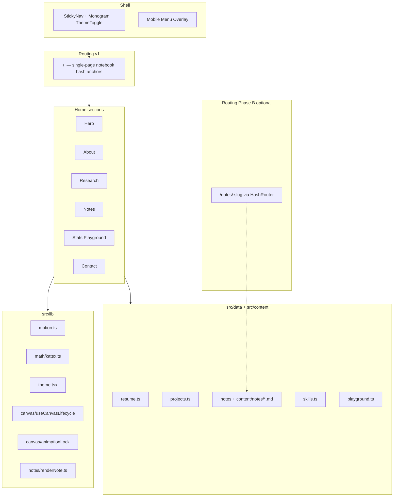

# Portfolio Redesign: Living Research Notebook

| Field | Value |
| --- | --- |
| **Document** | Design Specification — hvbhanot.pro |
| **Author** | Engineering Design (agent-authored) |
| **Date** | 2026-08-11 |
| **Status** | Draft (rev 3 — residual review issues addressed) |
| **Repo** | `/Users/harshvardhanbhanot/Desktop/hvbhanot.github.io` |
| **Domain** | https://hvbhanot.pro |
| **Tagline** | *Harsh Vardhan Bhanot — AI Systems Built on Mathematics.* |

---

## Overview

The current portfolio (`src/App.tsx`, ~495 lines) is a polished monochrome single-page instrument: Anton display type, IBM Plex Mono utilities, a graph-paper ground, and a rose-curve canvas hero (`src/components/MathDial.tsx`). Content is data-driven (`src/data/*`) with sections Hero → About → Experience → Work → Toolkit → Contact. It is intellectually adjacent to the brief but visually monochrome, lacks real math typesetting, has no Notes or interactive Stats Playground, and freezes light mode out by design.

This redesign repositions the site as a **Living Research Notebook**: Distill.pub rigor + 3Blue1Brown clarity + arXiv paper aesthetics + modern dark-mode craft. Math is structural (KaTeX equations, generative SVG/canvas motifs derived from probability and optimization), not decorative. The information architecture shifts from résumé-forward (Experience / Work / Toolkit) to research-notebook-forward (**About · Research · Notes · Stats · Contact**), with Experience folded into About as a citation-style timeline.

**Recommended stack decision:** stay on **Vite + React 19 + TypeScript**. The codebase **actively uses** Framer Motion (via `src/lib/motion.ts`) and a custom 2D canvas hero. Separately, `package.json` lists **installed but unused** dependencies: `three`, `@react-three/fiber`, `@react-three/drei`, `marked`, and `react-router-dom` — none are imported under `src/` today. Migrating to Astro/Next/Hugo would discard working animation/canvas patterns and reintroduce Astro-action deploy debt already noted in `CLAUDE.md`. Incremental redesign on the existing foundation is the lower-risk path.

**v1 dependency policy (binding):**

| Package | v1 decision |
| --- | --- |
| `framer-motion` | Keep — core motion path |
| `marked` | **Wire in PR 8** for Notes MD pipeline |
| `react-router-dom` | **Leave installed**; mount only in optional PR 12 for `/notes/:slug` (see deep-link decision). Not on v1 critical path for the single-page notebook. |
| `three`, `@react-three/fiber`, `@react-three/drei` | **Remove in PR 0** — dead weight, not on critical path; re-add only if a scheduled 3D hero ships later |
| `katex` | **Add** for math rendering |
| `d3` / modular d3 | **Not required for v1** — pure canvas first; optional later |

---

## Background & Motivation

### Current state (grounded in repo)

| Layer | Today |
| --- | --- |
| Entry | `src/main.tsx` → single `<App>` in StrictMode; **no router mounted** |
| Sections | `#top`, `#about`, `#experience`, `#work`, `#toolkit`, `#contact` (match Playwright) |
| Hero | `MathDial.tsx` — protractor rings + rose curve \(r = a\cos(k\theta)\); pauses via `IntersectionObserver`; respects `prefers-reduced-motion`; **captures `--ink-rgb` once at mount** (`useEffect` `[]` deps — does not re-theme today) |
| Hero H1 | **Tagline as `h1`**: stacked lines “AI systems / built on / mathematics.” — **not** name-first (redesign deliberately changes hierarchy) |
| Motion | `src/lib/motion.ts` — `fadeUp`, `staggerContainer`, `reveal`; flattens under reduced motion |
| Content | `resume.ts`, `projects.ts`, `skills.ts`, `research.ts` |
| Unused research copy | `methodStatement` and `researchQuote` in `research.ts` **exist but are not rendered** in `App.tsx` — redesign will surface them |
| Featured work rule | `projects.filter(p => p.status !== 'archived')` — so `ongoing` (TorchPilot) already appears in the main list |
| Styling | Hand-written system in `src/index.css` (`:root` tokens; ~936 lines); Tailwind 3 mirrors monochrome in `tailwind.config.js`; pages use custom classes |
| Theme | Dark-only (`color-scheme: dark`); no toggle |
| Installed but unused deps | `three`, `@react-three/*`, `marked`, `react-router-dom` — **not imported under `src/`**; do not currently land in the client bundle |
| Actively used animation | Framer Motion + canvas 2D only |
| Deploy | GitHub Pages via `.github/workflows/deploy.yml` (**`withastro/action@v3`**); Railway via `railway.json` + `serve -s dist` |
| Static assets | `public/favicon.svg`, `public/future-research-hero.png`, `Resume_*.pdf`; `dist/og.png` present; multi-MB hero/OG assets may need refresh/deletion |
| Tests | `tests/portfolio-scene.spec.js` — section IDs, no horizontal overflow, `.work-row` modal + “Highlights” text; **requires server already on :4321** (no `playwright.config` webServer) |
| Port | **4321** (`vite.config.js`) |
| Modal a11y | Escape + body scroll lock; **no focus trap** |

### Pain points relative to brief

1. **Identity gap** — Monochrome “steven.com instrument” vs multi-accent research notebook.
2. **Typography gap** — Anton condensed all-caps vs STIX paper-serif headings; equations are plain monospace (`.eq`), not KaTeX.
3. **IA gap** — Experience/Work/Toolkit ≠ About/Research/Notes/Stats.
4. **Math as decoration** — Floating Unicode equation strings, not typeset math.
5. **Content reconciliation** — Brief mentions Intel Student Ambassador; data has no Intel entry. Hugging Face URL absent. Dual-MS wording is “heading into” Fall 2026.
6. **Deploy fragility** — Astro action on a Vite build.
7. **Dead dependency clutter** — R3F/three installed but unused; inflate install time and confuse stack docs.

### Why change now

The persona is dual-track Statistics + CS with research tooling and agents. A notebook metaphor communicates that more honestly than a generic developer landing page. Interactive Stats micro-experiments differentiate the portfolio and reinforce “built on mathematics.”

---

## Goals & Non-Goals

### Goals

1. Ship a **visual identity system** (tokens, type, motifs) that reads as a research notebook at a glance.
2. Restructure IA to **About / Research / Notes / Stats / Contact** with deep-linkable anchors.
3. Integrate **KaTeX** for real inline/display math across hero, research cards, notes, and playground captions.
4. Add **Stats Playground** with interactive micro-experiments (v1 target: **4**, shippable as **2+2** PRs), each with pedagogical copy and non-visual summaries.
5. Support **dark (default)** fully; ship **light tokens + toggle** only after contrast audit (see Theme).
6. Keep **performance budgets**: exclusive autoplay canvas lock; pause offscreen; honor `prefers-reduced-motion`; controlled font payload.
7. Remain **data-driven**: content in `src/data/` and `src/content/notes/`; JSX stays structural.
8. Fix deploy pipeline to plain `vite build` for GitHub Pages **before** visual merges to `main`.
9. Incremental **PR plan (single source of truth for order)** so each merge is reviewable.

### Acceptance criteria (definition of done)

| Criterion | Measure |
| --- | --- |
| Sections | `#top` `#about` `#research` `#notes` `#stats` `#contact` each present once |
| Identity | Name-first hero + tagline “AI Systems Built on Mathematics.” visible without scrolling on desktop ≥1280 |
| Math | Opening a Research modal shows at least one `.katex` node for featured projects with `abstractTex` |
| Research content | Every non-archived project has `tags` + (`abstract` or `abstractTex`) + modal body that never renders empty P/M/R headings (see content SLA) |
| Overflow | Playwright: `scrollWidth ≤ clientWidth + 2` at 1440×1000 and 390×844 |
| Theme FOUC | No white flash: boot script sets `data-theme` before paint |
| Canvas | With hero fully offscreen and Stats offscreen, **zero** rAF loops (manual Performance panel check) |
| Reduced motion | `prefers-reduced-motion: reduce` → no card tilt, no autoplay GD, hero single static frame |
| Perf (soft target) | Lighthouse Performance ≥ 80 mobile after particle reduction; LCP is text not canvas |
| Typecheck / tests | `npm run typecheck` clean; `npm run test:scene` green with preview/dev on :4321 |
| Deploy | Pages workflow builds Vite `dist/` without Astro action |

### Non-Goals

- Full CMS / headless blog platform.
- Real-time multiplayer experiments or server-side computation.
- Rebuilding every archived project into a research paper.
- Native mobile apps or offline PWA.
- Migrating to Astro, Next.js, or Hugo in v1.
- Pixel-perfect Distill.pub clone or 3D-only portfolio.
- MDX compiler pipeline in v1 (marked + KaTeX post-pass instead).
- Shipping light mode without contrast audit pass.

---

## Proposed Design

### Design metaphor

> Opening a well-kept research notebook: ruled margins, theorem boxes, hand-sketched figures that happen to be generative code, and experiments you can re-run.

Every decorative surface must map to a mathematical object:

| Motif | Math object | Usage |
| --- | --- | --- |
| Vector field | \(\mathbf{v}(x,y)\) | Hero / section backgrounds (subtle) |
| Gradient descent path | \(\theta_{t+1}=\theta_t-\eta\nabla J\) | Hero primary animation; Stats playground |
| Multivariate Gaussian | \(\mathcal{N}(\mu,\Sigma)\) | Hero alternate; sampling experiment |
| Neural graph | adjacency / layer diagram | Research card accents (nnNode) |
| Confusion matrix | heatmap grid | Classification project metrics |
| Loss surface | \(J(\theta)\) contour | Card hover glow / vignette |
| Voronoi / Delaunay | partition of plane | Notes page ornament (optional) |
| LaTeX marginalia | lemmas, Q.E.D. | Section sides, contact footer |

### High-level architecture



### Stack decision (mandatory)

| Option | Pros | Cons | Verdict |
| --- | --- | --- | --- |
| **Stay Vite + React 19** | MathDial, Framer Motion, Railway SPA serve, TS strict, port 4321 | SPA SEO limited | **Choose** |
| Migrate Astro | SSG, content collections | Re-port interactivity; deploy already half-broken | Defer |
| Migrate Next.js | App Router, MDX | Overkill; config rewrite | Reject v1 |
| Hugo | Fast static | Poor fit for canvas playground | Reject |

**SEO note:** For this personal portfolio, inbound traffic is primarily GitHub/LinkedIn/resume — not organic search. SPA SEO cost of staying on Vite is acceptable; SSG becomes relevant only if Notes grow into a large public wiki.

**Router strategy — v1 (PR 0–11, binding):**

- **No React Router mounted.** Section navigation is plain fragment IDs on a single document: `#top`, `#about`, `#research`, `#notes`, `#stats`, `#contact` (plus optional `#about-skills` for skills block).
- Sticky nav uses `<a href="#about">` etc.; browser smooth-scroll + existing `html { scroll-behavior: smooth }` apply.
- Playwright and legacy-hash redirects operate only on these section fragments.

**Router strategy — Phase B / PR 12 (binding navigation contract):**

Phase B needs shareable note URLs without a Pages rewrite layer. **Chosen pattern: HashRouter with a single hash namespace and explicit section navigation helpers** — not bare `href="#about"` once the router is mounted.

| Hash shape | Meaning |
| --- | --- |
| `#/` or `#` or empty | Home notebook (full page of sections); scroll position independent unless a section intent is also encoded |
| `#/about`, `#/research`, `#/notes`, `#/stats`, `#/contact`, `#/top` | **Home + scroll-to-section** routes (path-style under the hash) |
| `#/notes/:slug` | Full note article view (replaces main content or nested outlet — prefer full-page `NoteArticle`) |
| Legacy v1 bookmarks `#about` (no slash) | On boot, normalize: if `location.hash` matches `^#([a-z][\w-]*)$` and is a known section id, `replaceState` to `#/<id>` then scroll |

**Implementation rules (PR 12):**

1. Mount `HashRouter` at the app root **only in PR 12**. Until then, do not import router APIs.
2. **Never use bare `href="#section"` after HashRouter is on.** Section nav links call a shared helper:

```ts
// src/lib/nav.ts
export const SECTIONS = ['top', 'about', 'research', 'notes', 'stats', 'contact', 'about-skills'] as const;

/** Navigate to home section under HashRouter and scroll into view. */
export function goToSection(sectionId: string, navigate: NavigateFunction) {
  navigate(`/${sectionId === 'top' ? '' : sectionId}`.replace(/\/$/, '') || '/');
  // After paint:
  requestAnimationFrame(() => {
    document.getElementById(sectionId)?.scrollIntoView({ behavior: prefersReduced ? 'auto' : 'smooth' });
  });
}
```

   Practical mapping: route path `/` = top of home; path `/research` = home with scroll to `#research` element (elements keep `id="research"` for scroll targets and a11y). Note routes live at path `/notes/:slug` → hash `#/notes/lora-rank`.

3. **Home layout** remains one long page; a thin route layer chooses:
   - `index` + section paths → render full notebook shell (all sections mounted), then scroll.
   - `notes/:slug` → render `NoteArticle` only (or shell with article replacing `<main>`), with nav “back” via `goToSection('notes')` or `navigate('/')` + scroll to notes list.

4. **Monogram / CTAs:** use `goToSection` or `<Link to="/research">` (HashRouter `Link`), never raw fragment-only hrefs.

5. **Playwright after PR 12:** assert `id` attributes still exist on sections when on home routes; for note pages assert article content; section deep links test `#/about` style if HashRouter is on.

6. **Alternative rejected for PR 12:** `?note=slug` query on `/` only — simpler, but loses clean note URLs and still requires scroll logic; kept as fallback if HashRouter integration cost is too high (document in PR 12 if pivoting).

7. **Do not mix** `#about` (v1) and `#/about` (Phase B) in nav data after PR 12; migrate `navItems` to path form consumed by `Link`/`goToSection`:

```ts
// Phase B navItems
export const navItems = [
  { label: 'About', to: '/about' },
  { label: 'Research', to: '/research' },
  // ...
];
```

**Production host default until user confirms OQ10:** Treat **Railway** as the working production path if Pages remains broken; **PR 0 must land before any design PR merges to `main`** so Pages is also valid. Custom domain `hvbhanot.pro` DNS is an open question — implementers assume both hosts must serve the same `dist/`.

---

## Visual Identity System

### Color tokens

Keep dual source of truth: **`src/index.css` `:root` / `[data-theme]`** and **`tailwind.config.js`**. Prefer CSS variables in component classes.

#### Dark theme (default) — user-specified

```css
:root,
[data-theme="dark"] {
  color-scheme: dark;

  --bg: #0B0C10;
  --bg-raise: #15161A;
  --bg-sunken: #08090C;
  --surface-hover: #1A1C22;

  --ink: #E8E8E8;
  --ink-rgb: 232, 232, 232;
  --ink-dim: #8B8D93;
  --ink-faint: rgba(232, 232, 232, 0.36);
  --ink-mute: rgba(139, 141, 147, 0.72);

  --line: rgba(232, 232, 232, 0.12);
  --line-strong: rgba(232, 232, 232, 0.22);
  --grid: rgba(232, 232, 232, 0.045);
  --gutter: clamp(20px, 4.5vw, 64px);

  --accent-prob: #4AA3F2;
  --accent-gd: #F2994A;
  --accent-proof: #27AE60;
  --accent-math: #BB86FC;

  --accent-prob-rgb: 74, 163, 242;
  --accent-gd-rgb: 242, 153, 74;
  --accent-proof-rgb: 39, 174, 96;
  --accent-math-rgb: 187, 134, 252;

  --focus-ring: var(--accent-prob);
  --selection-bg: color-mix(in srgb, var(--accent-prob) 35%, transparent);
  --glow-prob: 0 0 40px rgba(74, 163, 242, 0.18);
  --glow-gd: 0 0 40px rgba(242, 153, 74, 0.16);
  --shadow-card: 0 12px 40px rgba(0, 0, 0, 0.35);
}
```

#### Light theme (tokens ship in PR 1; toggle activates after contrast audit)

```css
[data-theme="light"] {
  color-scheme: light;

  --bg: #F4F2EC;
  --bg-raise: #FFFFFF;
  --bg-sunken: #E8E6DF;
  --surface-hover: #EFEDE6;

  --ink: #16171C;
  --ink-rgb: 22, 23, 28;
  --ink-dim: #5C5F66;
  --ink-faint: rgba(22, 23, 28, 0.42); /* raised vs dark for paper legibility */
  --ink-mute: rgba(92, 95, 102, 0.85);

  --line: rgba(22, 23, 28, 0.14);
  --line-strong: rgba(22, 23, 28, 0.24);
  --grid: rgba(22, 23, 28, 0.07);

  --accent-prob: #2B7FD4;
  --accent-gd: #C2410C;      /* deeper orange for WCAG on paper */
  --accent-proof: #15803D;
  --accent-math: #7C3AED;    /* deeper lavender for body-size text */

  --accent-prob-rgb: 43, 127, 212;
  --accent-gd-rgb: 194, 65, 12;
  --accent-proof-rgb: 21, 128, 61;
  --accent-math-rgb: 124, 58, 237;

  --shadow-card: 0 12px 32px rgba(22, 23, 28, 0.08);
}
```

#### Contrast audit pairs (must pass before enabling light toggle for users)

| Pair | Requirement |
| --- | --- |
| `--ink` on `--bg` | ≥ 4.5:1 (body) |
| `--ink-dim` on `--bg` | ≥ 4.5:1 (secondary body) |
| `--ink-faint` on `--bg` | decorative only; **not** sole carrier of meaning |
| `--accent-math` on `--bg` / `--bg-raise` | ≥ 4.5:1 if used for text links |
| Status pills (proof green bg + label) | ≥ 4.5:1 |
| Grid lines | decorative; ignore for text contrast |
| Decorative KaTeX (`.eq-decorative`) | `aria-hidden`; faint ink OK |

**Known failure risks to fix in audit:** lavender `#BB86FC` as small text on graphite; orange chips on dark; light-mode `--ink-faint` on paper for equation marginalia (prefer hide decorative eqs on light mobile).

#### Semantic accent usage

| Accent | When to use |
| --- | --- |
| **Probability blue** | Inference, sampling, Bayes, primary CTA, focus ring |
| **GD orange** | Optimization, training, `ongoing` status |
| **Proof green** | Verified/success metrics only (see metrics rules below) |
| **Math lavender** | Theorems, Notes, equation highlights |

**Rule:** One primary accent per surface; second only for metric contrast.

#### Metrics → accent mapping

| Metric kind | Accent | Rule |
| --- | --- | --- |
| Qualitative / counts (tools, params, n) | `--ink-dim` or blue | Neutral chips — **not** proof green |
| Accuracy / F1 / success rate | proof green **only if** value is explicitly a “good” result the author claims; otherwise neutral | No automatic threshold math — **author flags** `metric.tone: 'success' \| 'neutral' \| 'warn'` |
| Ongoing / incomplete | GD orange | Status pill |
| Archived | faint ink | Status pill |

```ts
export type ProjectMetric = {
  label: string;
  value: string;
  tone?: 'success' | 'neutral' | 'warn'; // default neutral
};
```

### Typography

| Role | Family | Notes |
| --- | --- | --- |
| **Display / headings** | **STIX Two Text** (fallback: Libertinus Serif, Georgia) | Paper aesthetics; sentence case, not all-caps Anton |
| **Math** | **KaTeX default fonts only** | Do **not** load “STIX Two Math” from Google Fonts — that family is not the GF Text package and is not required for v1 |
| **Body** | **Inter** | Academic prose |
| **UI mono / labels / code** | **IBM Plex Mono** | Eyebrows, catalog, **and Notes code blocks in v1** |

**v1 font load decision (binding):**

- Load: STIX Two Text + Inter + IBM Plex Mono with `display=swap` (already have preconnect in `index.html`).
- **Do not add JetBrains Mono in v1** — use IBM Plex Mono for code to reduce payload.
- KaTeX CSS (and its fonts) load globally in PR 4 with `katex/dist/katex.min.css`; acceptable for notebook site where math is core. Optional later: split CSS to Notes/Research only via dynamic import.
- Self-host STIX remains Open Question 11; default v1 = Google Fonts + `display=swap`.

```css
@import url('https://fonts.googleapis.com/css2?family=Inter:wght@400;500;600&family=IBM+Plex+Mono:wght@400;500&family=STIX+Two+Text:ital,wght@0,400;0,600;0,700;1,400&display=swap');
```

**Type scale**

| Token | Size | Usage |
| --- | --- | --- |
| `--text-xs` | 11–12px | Eyebrows, catalog |
| `--text-sm` | 13–14px | Meta, captions |
| `--text-base` | 16px | Body |
| `--text-md` | 18px | Section lede |
| `--text-lg` | clamp(1.25rem, 2vw, 1.5rem) | Card titles |
| `--text-xl` | clamp(1.75rem, 3.5vw, 2.5rem) | Section theorem titles |
| `--text-display` | clamp(2.75rem, 7vw, 5.5rem) | Hero tagline |
| `--text-hero-name` | clamp(2.5rem, 6vw, 4.5rem) | Name in STIX |

**Heading system (theorem-style)**

```
( § 02 · Research )
From Data to Decision
─────────────────────
```

### Spacing, radii, elevation

| Token | Value |
| --- | --- |
| `--space-1` … `--space-8` | 4, 8, 12, 16, 24, 32, 48, 64 px |
| `--radius-sm` / `md` / `lg` / pill | 4 / 10 / 16 / 999 |
| Section padding | `clamp(72px, 12vh, 140px)` |

### Background motif

Faint squared notebook (retinted graph paper), denser 48px grid. Optional left margin rule on desktop.

---

## Information Architecture

### Section map (target)

| Order | ID | Nav label | Replaces / absorbs |
| --- | --- | --- | --- |
| 0 | `#top` | — | Hero (hierarchy change: name-first) |
| 1 | `#about` | About | About + Experience timeline + SkillViz (ex-Toolkit) |
| 2 | `#research` | Research | Work reframed |
| 3 | `#notes` | Notes | New |
| 4 | `#stats` | Stats | New |
| 5 | `#contact` | Contact | Contact LaTeX header style |

### Experience placement

No top-nav item. Inside About: education path + vertical timeline from `experience[]`.

### Nav items

```ts
export const navItems: NavItem[] = [
  { label: 'About', href: '#about' },
  { label: 'Research', href: '#research' },
  { label: 'Notes', href: '#notes' },
  { label: 'Stats', href: '#stats' },
  { label: 'Contact', href: '#contact' },
];
```

### IA transition strategy (PR 3) — binding

PR 3 implements a **coherent intermediate IA**, not dual competing trees.

| Action in PR 3 | Detail |
| --- | --- |
| **Remove** section wrappers `#experience`, `#work`, `#toolkit` | Do not keep dual IDs |
| **Legacy deep-link compat** | On mount (v1, no router), map and `history.replaceState` once, then scroll: **`#experience` → `#about`** (timeline); **`#toolkit` → `#about-skills`** if present, else **`#about`** (skills / former Toolkit live in About — **not** Research); **`#work` → `#research`**. Document intentional bookmark migration. |
| **Stable sub-ids in About** | Add `id="about-skills"` on the skill tags block (and optionally `id="about-timeline"` on the experience timeline) so legacy toolkit links and in-page CTAs can target them without hijacking the whole About section. |
| **Move Experience into About** | Same PR: render `experience[]` as timeline under About (markup may still use `.xp-*` classes for CSS stability) |
| **Retarget Work → Research shell** | Same list UI or thin card list is OK; class `work-row` may remain until PR 6 renames to `research-card` **with dual class** `className="work-row research-card"` during transition |
| **Toolkit** | Collapse into About as simple tag clouds under `#about-skills` (SkillViz radar deferred — see SkillViz) |
| **Notes stub** | `#notes` section with theorem heading *Working Notes*, one-line lede, and muted “Seed notes land in a follow-up PR” — not a blank gap |
| **Stats stub** | `#stats` section with heading *Sampling Until Certainty*, lede, and “Interactive experiments land in a follow-up PR” |
| **Playwright** | Assert new section IDs only; legacy IDs must have count 0 |

**Legacy hash map (canonical):**

```ts
// src/lib/legacyHash.ts — v1 (plain location.hash)
const LEGACY_HASH: Record<string, string> = {
  experience: 'about',       // or 'about-timeline' if that id exists
  toolkit: 'about-skills',   // skills live in About — NOT research
  work: 'research',
};

// On boot: const key = location.hash.replace(/^#/, '');
// if (LEGACY_HASH[key]) { const target = LEGACY_HASH[key];
//   history.replaceState(null, '', `#${target}`);
//   document.getElementById(target)?.scrollIntoView(); }
```

---

## Section-by-Section Layout Specs

### 0. Shell — Sticky Nav

```
[ Σ[HVB] ]   About  Research  Notes  Stats  Contact   [ (CRP) 14:32 ]  [ theme ]  [Menu]
```

- Monogram SVG (sigma or matrix bracket), links `#top`
- Clock: Corpus Christi (`America/Chicago`) — keep
- ThemeToggle (dark-only behavior until audit; light selectable only when `import.meta.env.VITE_ENABLE_LIGHT_THEME === 'true'`; **unset/default = light disabled**)
- Mobile: monogram + theme + menu; clock hide ≤640px

**Extract guidance:** Prefer extract-with-identical-markup first (same DOM/CSS classes), then visual redesign — reduces noisy diffs (see PR 3 notes).

### 1. Hero (`#top`)

**Deliberate hierarchy change:** Current H1 is the tagline stack. Target:

1. **Name** (visual display, STIX) — may be `h1` or `p.hero-name` + **tagline as `h1`** if SEO prefers tagline; **decision: `h1` = full name**, tagline = `p.hero-tagline` with large display styles (one H1 = name for AT clarity).
2. Tagline exact: *AI Systems Built on Mathematics.*
3. Sub-line: *Dual MS in Statistics & Computer Science · Research Assistant · TensorTonic Rank 42* (**default copy until user confirms** dual-MS enrollment wording — see defaults)
4. CTAs: View Research (`#research`), Read Notes (`#notes`), GitHub (external)
5. Decorative KaTeX marginalia `aria-hidden`

**Canvas:** `HeroCanvas` scenes: default **`gradient-descent`**; alternate `gaussian`; legacy `rose` (MathDial). Caption mono under canvas.

### 2. About (`#about`)

**Eyebrow:** `( § 01 · About )`  
**Title:** *From Data to Decision*  
**Surface:** `profile.bio` (defaults until user edits), **`methodStatement` and `researchQuote` (currently unused — render them)**  

**Block order (top → bottom):**

1. Bio + method statement  
2. Education path (BS → Dual MS)  
3. Experience timeline (`experience[]`)  
4. Citation metrics chips (TensorTonic, FTIP, RA, Founder)  
5. **Skill tags** from `skillGroups` (category headings + chips) — **v1 primary skills UI**; wrapper **`id="about-skills"`**  
6. **SkillViz radar** — **optional / deferred** until user confirms axis values (see Data Model). If present, place above tag clouds with caption *Relative emphasis, not benchmarks.*  
7. Focus areas (`focusAreas`) as lemma cards  

### 3. Research (`#research`)

**Title:** *Building Models, Not Just Metrics*  
**TagFilter** tags (no `archive` tag — use status for archival):  
`agents`, `automl`, `systems`, `vision`, `teaching`, `statistics`, `security`, `deep-learning`

**Featured grid rule (single):**

```ts
function isFeatured(p: Project): boolean {
  if (p.featured === false) return false;
  if (p.featured === true) return true;
  return p.status !== 'archived';
}
```

**nnNode promotion:** Change **`status` from `archived` → `active`** (or `ongoing`) and set `featured: true` if needed. Do **not** leave `status: 'archived'` with `featured: true` (would double-list if archive UI also lists archived).

**Content SLA for PR 6 (non-archived / featured):**

| Field | Required |
| --- | --- |
| `tags` | ≥1 |
| `abstract` or `abstractTex` | ≥1 |
| Modal body | Structured: if `problem`/`method`/`result` missing, render **single “Overview”** section from `description` + “Highlights” from `highlights` — **never** empty “Problem” heading |

**Archive list:** `status === 'archived'` only.

### 4. Notes (`#notes`)

Phase A on home page (section `#notes`, no router). Phase B only via PR 12 using the **HashRouter navigation contract** under **Proposed Design → Router strategy — Phase B / PR 12** (path hashes `#/notes/:slug`, section nav via `goToSection` / `#/research` — never bare `#research` after router mount). Pipeline: [Notes Content Model](#notes-content-model). Golden note in Appendix B.

### 5. Stats Playground (`#stats`)

Four experiments; ship as PR 9a + 9b. Specs: [Stats Playground](#stats-playground-technical-design).

### 6. Contact (`#contact`)

LaTeX **cosplay** header (mono/STIX styled fake `\documentclass{correspondence}`):

- Wrap decorative correspondence block in **`aria-hidden="true"`** so screen readers do not hear backslash soup
- **Always** expose an accessible heading in the real (non-hidden) DOM:
  - **Default (recommended):** visible `<h2 class="contact-title">Contact</h2>` (or “Correspondence”) above or beside the cosplay block, styled with STIX/section title tokens
  - **Optional alternate:** if the design makes the cosplay the only large visual title, still keep `<h2 class="sr-only">Contact</h2>` for AT — never omit the `h2`
- Do **not** use a class named `visually-oriented` (non-standard / ambiguous)
- Real links (email, LinkedIn, GitHub; HF if URL confirmed) **outside** the aria-hidden block
- Footer Q.E.D. retained

---

## Component Inventory

### File structure (proposed)

```
src/
  main.tsx
  App.tsx
  index.css
  components/
    nav/ StickyNav.tsx Monogram.tsx MenuOverlay.tsx ThemeToggle.tsx Clock.tsx
    hero/ Hero.tsx HeroCanvas.tsx
    about/ About.tsx EducationPath.tsx ExperienceTimeline.tsx SkillViz.tsx CitationMetrics.tsx
    research/ Research.tsx ResearchCard.tsx ResearchModal.tsx TagFilter.tsx
    notes/ Notes.tsx NoteCard.tsx NoteArticle.tsx
    playground/
      StatsPlayground.tsx PlaygroundExperiment.tsx
      experiments/ SamplingDist.tsx LinearRegression.tsx BayesianUpdate.tsx GradientDescent.tsx
    contact/ Contact.tsx ContactHeader.tsx
    math/ Equation.tsx TheoremHeading.tsx
    ui/ Section.tsx TagChip.tsx StatusPill.tsx Button.tsx
  data/ resume.ts projects.ts research.ts skills.ts notes.ts playground.ts
  content/notes/*.md
  lib/
    motion.ts
    theme.tsx
    math/katex.ts
    notes/renderNote.ts
    canvas/useCanvasLifecycle.ts animationLock.ts prefersReduced.ts
    rng.ts
```

### Component APIs

#### `Equation`

```tsx
type EquationProps = {
  tex: string;
  display?: boolean;
  className?: string;
  decorative?: boolean;
  altText?: string;
};
```

Trusted TeX only from repo data. `throwOnError: false`.

#### `Monogram` / `HeroCanvas` / `TagFilter` / `Section`

As in rev 1; `HeroCanvas.scene` default `'gradient-descent'`.

#### `useCanvasLifecycle` (binding API)

```ts
type UseCanvasLifecycleOptions = {
  draw: (ctx: CanvasRenderingContext2D, t: number, colors: CanvasColors) => void;
  /** When true, request exclusive autoplay lock */
  autoplay?: boolean;
  deps?: unknown[];
};

type CanvasColors = {
  ink: string; // "r, g, b"
  accents: Record<'prob' | 'gd' | 'proof' | 'math', string>;
};

function readColors(): CanvasColors {
  const cs = getComputedStyle(document.documentElement);
  const rgb = (name: string, fb: string) => cs.getPropertyValue(name).trim() || fb;
  return {
    ink: rgb('--ink-rgb', '232, 232, 232'),
    accents: {
      prob: rgb('--accent-prob-rgb', '74, 163, 242'),
      gd: rgb('--accent-gd-rgb', '242, 153, 74'),
      proof: rgb('--accent-proof-rgb', '39, 174, 96'),
      math: rgb('--accent-math-rgb', '187, 134, 252'),
    },
  };
}

// Lifecycle must:
// 1. ResizeObserver + DPR min(devicePixelRatio, 2)
// 2. IntersectionObserver: visible && !prefersReduced && (autoplay ? acquireLock(id) : true) → rAF
// 3. MutationObserver on documentElement attributes (data-theme) OR listen window 'hvb-theme'
//    → re-read colors + redraw static frame immediately
// 4. prefers-reduced-motion → single static frame, no rAF
// 5. cleanup: cancel rAF, release lock, disconnect observers
```

#### Global animation lock

```ts
// src/lib/canvas/animationLock.ts
// Only one autoplay canvas holds the lock.
// Hero autoplay=true; playground autoplay only when experiment is active AND section ≥50% visible.
// Parameter-driven redraws (sliders) always allowed without lock; continuous rAF requires lock.
```

#### `SkillViz`

```tsx
type SkillVizProps = {
  axes: { label: string; value: number }[];
  mode?: 'radar' | 'densities';
};
```

**v1 default:** do not mount SkillViz until `skillAxes` confirmed by user; PR 5 ships tag clouds only.

#### `ThemeToggle` / `ResearchCard` / `PlaygroundExperiment`

Unchanged intent from rev 1; ResearchCard tilt disabled under reduced motion; modal open/close also uses reduced-motion flat transitions via `motion.ts`.

#### Modal a11y

Focus trap + Escape + restore focus + `aria-modal`. Test queries: prefer `getByRole('dialog')` and headings “Overview” / “Problem” rather than brittle “Highlights” alone.

---

## Animation & Interaction Plan

| Concern | Tool |
| --- | --- |
| Section enter, modal, menu, card hover | Framer Motion (`motion.ts`) |
| Playground charts | **Canvas 2D first** (no D3 required v1) |
| Hero continuous field | Canvas 2D |
| R3F | **Not in v1** (packages removed) |
| GSAP | **Do not add** |

### Performance budget

| Metric | Target |
| --- | --- |
| Autoplay rAF | ≤ 1 document-wide via `animationLock` |
| DPR | `min(devicePixelRatio, 2)` |
| Main JS | Lazy playground experiments (`React.lazy`) |
| Fonts | 3 families + KaTeX; `display=swap`; no JetBrains |
| LCP | Name/tagline text |
| CLS | Reserve canvas aspect box |
| Mobile | Lower particles / contour resolution ≤640px |

### Reduced motion

- Flatten FM variants (`motion.ts`).
- Hero static frame.
- No card tilt; no autoplay GD; playground redraw on input only.
- Modal: opacity-only transitions.

---

## Math Rendering Plan (KaTeX)

```bash
npm install katex
npm install -D @types/katex
```

```ts
// src/lib/math/katex.ts
import katex from 'katex';

export function renderTex(tex: string, displayMode = false): string {
  return katex.renderToString(tex, {
    throwOnError: false,
    displayMode,
    output: 'html',
    strict: 'ignore',
  });
}
```

Import `katex/dist/katex.min.css` in `main.tsx` (PR 4).

**Headings:** STIX Two **Text** only. **Math:** KaTeX fonts only — never load STIX Two Math webfont for v1.

---

## Notes Content Model

### v1 algorithm (binding) — marked + KaTeX post-pass

**Trust boundary:** Author-only Markdown in the repo. No user-generated content. **Disable raw HTML** in marked.

```ts
// src/lib/notes/renderNote.ts
import { marked } from 'marked';
import { renderTex } from '../math/katex';

export type ParsedNote = {
  meta: { title: string; date: string; tags: string[]; summary?: string };
  html: string; // trusted HTML after pipeline
};

marked.setOptions({
  gfm: true,
  breaks: false,
});

// If marked version supports hooks/walkTokens, strip HTML:
// Prefer: marked.use({ hooks: { preprocess(src) { return src.replace(/<[^>]+>/g, ''); } } })
// Or use a custom renderer that escapes HTML text. v1 rule: authors must not write raw HTML tags.

export function parseFrontmatter(raw: string): { meta: Record<string, string | string[]>; body: string } {
  // Simple fence: starts with ---\n ... \n---\n
  // Parse key: value lines; tags as comma-separated
}

/**
 * Split body into text / math segments WITHOUT matching $ inside code fences or inline code.
 * Algorithm:
 * 1. Tokenize by fenced code blocks (``` ... ```) first — leave untouched.
 * 2. Within non-code regions, replace $$...$$ (display) then $...$ (inline), non-greedy,
 *    requiring non-escaped $. Escaped \$ left as literal.
 * 3. Run marked.parse on text segments only; math segments → renderTex → <span class="katex-wrap">.
 * 4. Concatenate. Single container dangerouslySetInnerHTML in NoteCard/NoteArticle.
 */
export function renderNoteMarkdown(raw: string): ParsedNote { /* ... */ }
```

**Security:** No DOMPurify required if (a) raw HTML is stripped/escaped and (b) only `renderTex` + marked text nodes produce HTML. If any HTML is ever allowed, add DOMPurify. **Forbid author HTML in v1.**

**Alternative considered:** MDX via Vite — richer, heavier toolchain; deferred (see Alternatives).

### Phase A data

```ts
// src/data/notes.ts
import lora from '../content/notes/lora-rank.md?raw';

export type NoteMeta = {
  slug: string;
  title: string;
  date: string;
  tags: string[];
  summary: string;
  teaserTex?: string;
  readingMinutes: number;
  raw: string;
};

export const notes: NoteMeta[] = [
  {
    slug: 'lora-rank',
    title: 'LoRA rank as a bias–variance dial',
    date: '2026-05-01',
    tags: ['fine-tuning', 'statistics'],
    summary: 'Treat rank r as a statistical capacity knob, not a magic hyperparameter.',
    teaserTex: '\\Delta W = BA',
    readingMinutes: 4,
    raw: lora,
  },
];
```

### Phase B

See full **Phase B navigation contract** under Proposed Design → Router strategy. Summary:

- Hash URL for a note: `#/notes/lora-rank` (`HashRouter` path `/notes/lora-rank`)
- Section nav after PR 12: `#/about`, `#/research`, … via `Link` / `goToSection` — **not** `href="#about"`
- Legacy plain `#about` bookmarks normalized to `#/about` on boot
- No `404.html` copy required. Railway and Pages both work

---

## Stats Playground Technical Design

### Shared numerical rules

| Rule | Spec |
| --- | --- |
| RNG | `mulberry32(seed)` in `src/lib/rng.ts`; **every experiment has `seed` state** (default 42) + “Reseed” control |
| Web Workers | **Out of v1** |
| Histograms | Fixed **30 bins** unless `n_bins` override; domain = [min−ε, max+ε] of data or theoretical support |
| Param clamps | Documented per experiment; clamp on change |
| aria-live | Each experiment panel includes `<div className="sr-only" aria-live="polite">{summary}</div>` updated on param/draw changes |
| Autoplay | Only GD autoplay; must take `animationLock`; stop when section < 50% visible |

### 1. Sampling distributions

- **State:** `dist`, `n ∈ {5,10,30,100}`, `reps ∈ [200,2000]` (default 1000), `seed`
- **Algorithm:** sample means histogram, 30 bins
- **Summary text:** `Mean of means ≈ μ̂; sd of means ≈ s; n=…; reps=…`

### 2. Linear regression

- **Model:** \(y = 1.5x + 0.5 + \varepsilon\), \(\varepsilon\sim\mathcal{N}(0,\sigma^2)\)
- **State:** `n ≥ 2` (clamp min 2; if `n < 2` show message, no fit), `sigma`, `seed`, `playing`
- **OLS:** If \(X^\top X\) near-singular (shouldn’t for 2-param with spread x), skip update and surface “degenerate design”
- **Summary:** \(\hat\beta_0, \hat\beta_1, R^2\)

### 3. Bayesian updating (Beta–Binomial)

- **State:** `alpha, beta` clamped to `[0.05, 200]`, flips list, `seed` (for optional auto-flip sequence)
- **Density:** Evaluate Beta on grid of 200 points in (0,1); use log-gamma via `lanczos` or simple path for moderate α,β; at extremes clamp and warn in summary
- **Summary:** `Posterior Beta(α',β'); mean=α'/(α'+β'); H=… T=…`

### 4. Gradient descent

- **Losses:**
  - `quadratic`: \(J(x,y)=x^2 + a y^2\) with \(a=3\) default
  - `rosenbrock-lite`: \(J(x,y)=(1-x)^2 + 25(y-x^2)^2\) (scaled classic Rosenbrock; valley along \(y=x^2\))
- **State:** `eta` clamp `(1e-4, 1)`, start `(x0,y0)`, `loss`, `seed` (for random start button), autoplay flag
- **Summary:** `step t; θ=(x,y); J=…; η=…`

### Config model

```ts
export type PlaygroundConfig = {
  id: 'sampling' | 'regression' | 'bayes' | 'gd';
  title: string;
  lede: string;
  equation: string;
  accent: 'prob' | 'gd' | 'proof' | 'math';
};
```

---

## Data Model Migrations

### Profile defaults until user confirms

| Field | Default (ship) | Needs user? |
| --- | --- | --- |
| Dual-MS wording | Keep data truth: *heading into concurrent M.S. … Fall 2026*; hero subline may say “Incoming Dual MS …” not “currently enrolled” unless confirmed | Yes (OQ2) |
| Intel Ambassador | **Omit** | Yes (OQ1) |
| Hugging Face | **Omit link** | Yes (OQ3) |
| Phone | Keep in data; **do not** feature in Contact UI | Soft (OQ4) |
| Tagline | *AI Systems Built on Mathematics.* | No |

### Project type

```ts
export type ProjectStatus = 'active' | 'archived' | 'ongoing';

export type ProjectMetric = {
  label: string;
  value: string;
  tone?: 'success' | 'neutral' | 'warn';
};

export type Project = {
  catalog: string;
  title: string;
  subtitle: string;
  year: string;
  status: ProjectStatus;
  description: string;
  abstract?: string;
  abstractTex?: string;
  problem?: string;
  method?: string;
  result?: string;
  highlights: string[];
  technologies: string[];
  tags: string[];
  metrics?: ProjectMetric[];
  href?: string;
  demoHref?: string;
  /** explicit include/exclude from featured grid; see isFeatured() */
  featured?: boolean;
};
```

### Mapping table

| Project | tags | status change | featured rule |
| --- | --- | --- | --- |
| Relay | agents, systems | active | default |
| TorchPilot | automl, systems | ongoing | default |
| CTF-Agent | agents, security | active | default |
| Professor Tux | teaching, agents | active | default |
| OI Browser Agent | vision, agents | active | default |
| nnNode | statistics, deep-learning | **→ active** | featured |
| AskAI, Clutch-Call, Event REST API, Blockchain | systems / statistics | archived | archive list |

Full sample entries: **Appendix A**.

### Skills

- Keep `skillGroups` for tag clouds (PR 5).
- `skillAxes` optional content owned by user review — **do not invent radar as competence claim** in first About ship.

### Research copy

Render `methodStatement` + `researchQuote` (currently dead data).

---

## Theme System

1. Default dark; FOUC boot script in `index.html`.
2. `localStorage['hvb-theme']`; `document.documentElement.dataset.theme`.
3. Dispatch `window` event `hvb-theme` on change for canvases.
4. **PR 2:** implement provider + toggle UI. **Canonical flag (only name):** `VITE_ENABLE_LIGHT_THEME`. Light theme is selectable **only** when `import.meta.env.VITE_ENABLE_LIGHT_THEME === 'true'`. **Unset, empty, or any other value → light disabled** (toggle may still render but is `aria-disabled` / forces dark, or cycles dark-only). Do not use `VITE_LIGHT_THEME` or other aliases.
5. ThemeToggle morph moon/sun/ \(\bar{x}\); reduced-motion hard swaps icons.

---

## Responsive & Accessibility

### Breakpoints

≤640 / 641–959 / ≥960 / ≥1280 — reuse existing CSS media patterns.

### A11y checklist

- [ ] Contrast audit pairs (above) before light enable
- [ ] Focus rings `--accent-prob`
- [ ] Modal focus trap + Escape + restore
- [ ] Canvas decorative `aria-hidden`; playground `role="img"` + aria-live summary
- [ ] Tag filters `aria-pressed`
- [ ] Theme toggle descriptive `aria-label`
- [ ] Skip link `#main`
- [ ] Heading hierarchy: one `h1` (name)
- [ ] Contact cosplay `aria-hidden`; visible `h2.contact-title` or `h2.sr-only` “Contact” (never omit)
- [ ] Reduced motion on tilt, autoplay, modal
- [ ] Keyboard-operable cards/sliders

### Horizontal overflow

Preserve Playwright assertion at 1440 and 390.

---

## Content Inventory

| Surface | Action | PR |
| --- | --- | --- |
| `profile.bio` / hero subline | Defaults; user refine | 5 / 11 |
| Experience Intel | Omit until confirmed | — |
| Featured projects | Full P/M/R for Relay + CTF-Agent in PR 6; others SLA-minimum | 6 |
| Remaining featured | Fill P/M/R | 11 |
| Seed notes | ≥1 golden (Appendix B) in PR 8; 2–3 total | 8 |
| OG image | Refresh `og.png`; delete or stop shipping unused `future-research-hero.png` if unused | 11 |
| Meta theme-color | `#0B0C10` | 1 |

---

## Implementation Architecture

### Composition

ThemeProvider → StickyNav → main sections → ResearchModal. Extract sections from monolithic `App.tsx` **prefer identical markup first**.

### CSS strategy

- Tokens in PR 1 that existing classes already reference (`--bg`, `--ink`, …) so recolor is mechanical.
- **New accent utility classes land with their first consumer** (not a 936-line blast of unused accent rules in PR 1 alone).
- Keep classnames stable during extract PRs (`.hero-*`, `.xp-*`, dual `.work-row.research-card`).

### Deploy fix — full workflow (PR 0)

Also add `public/.nojekyll` (empty file) so Vite copies it into `dist/` (Jekyll bypass on Pages). Current `dist/` may already contain `.nojekyll` from prior builds — ensure source-controlled `public/.nojekyll`.

```yaml
# .github/workflows/deploy.yml
name: Deploy to GitHub Pages

on:
  push:
    branches: [main]
  workflow_dispatch:

permissions:
  contents: read
  pages: write
  id-token: write

concurrency:
  group: pages
  cancel-in-progress: false

jobs:
  build:
    name: Build
    runs-on: ubuntu-latest
    steps:
      - name: Checkout
        uses: actions/checkout@v4

      - name: Setup Node
        uses: actions/setup-node@v4
        with:
          node-version: 20
          cache: npm

      - name: Install and build
        run: |
          npm ci
          npm run build

      - name: Upload Pages artifact
        uses: actions/upload-pages-artifact@v3
        with:
          path: dist

  deploy:
    name: Deploy
    needs: build
    runs-on: ubuntu-latest
    environment:
      name: github-pages
      url: ${{ steps.deployment.outputs.page_url }}
    steps:
      - name: Deploy to GitHub Pages
        id: deployment
        uses: actions/deploy-pages@v4
```

### Optional PR CI (recommended)

```yaml
# .github/workflows/ci.yml — on pull_request
# npm ci && npm run typecheck && npm run build
# Playwright: add playwright.config.js webServer:
#   webServer: { command: 'npm run preview', port: 4321, reuseExistingServer: !process.env.CI }
```

### Testing updates

```js
const sections = ['top', 'about', 'research', 'notes', 'stats', 'contact'];
// Modal: page.locator('.research-card, .work-row').first()
// Prefer getByRole('dialog')
// Assert Overview or Problem, not only Highlights
```

Document in PR plan: **start `npm run preview` or `dev` on 4321** before `test:scene` until webServer config lands.

### CSP (optional, deploy docs)

Static site; if host allows headers: `default-src 'self'; script-src 'self'; style-src 'self' 'unsafe-inline' https://fonts.googleapis.com; font-src 'self' https://fonts.gstatic.com; img-src 'self' data:;`. KaTeX inline styles may need `'unsafe-inline'` for style. Not required for v1 launch.

---

## Security & Privacy Considerations

| Risk | Severity | Mitigation |
| --- | --- | --- |
| XSS via KaTeX | Medium | Trusted TeX only; `throwOnError: false` |
| XSS via marked | Medium | **No author HTML v1**; escape/strip tags; only marked text + KaTeX HTML |
| Project descriptions through MD | Low | Keep as plain text in React, not through marked |
| External images in notes | Low | Forbid remote images v1 (`` lint by convention) |
| Phone exposure | Low | Data only; not Contact UI |
| External links | Low | `rel="noreferrer"` |
| CSP | Low | Optional host headers |

---

## Observability

| Signal | Approach |
| --- | --- |
| Deploy | Actions + Railway |
| Bundle | `vite build` summary |
| Acceptance | Checklist in Goals |
| Analytics | **None in v1** (default) |

Rollback: git revert; redeploy previous `main`. Keep `MathDial` as `HeroCanvas` scene `rose` one release.

---

## Rollout Plan

**The PR Plan (PR 0–12) is the single source of truth for order.** This section does not redefine sequence.

### Merge gates

1. **No design PR merges to `main` until PR 0 is green** on GitHub Pages (or user confirms Railway-only production and Pages is non-blocking — default is PR 0 required).
2. Each PR: `npm run typecheck` + `npm run build` locally; `test:scene` when UI/IA changes (server on :4321).
3. Light theme user-visible enable only after contrast audit sign-off (may be end of PR 2 or PR 11).
4. Rollback = revert PR; hero fallback `scene="rose"`.

### Risk register

| Risk | Severity | Mitigation |
| --- | --- | --- |
| Bundle bloat | High | Remove R3F PR 0; lazy playground; canvas not D3 |
| Light contrast | Medium | Gate toggle |
| Deploy Astro break | High | PR 0 first + merge gate |
| Empty Research P/M/R | High | Content SLA + Appendix A samples in PR 6 |
| Multi-canvas CPU | Medium | animationLock + IO pause |
| Font LCP | Medium | 3 families + swap; no JetBrains |
| Playwright without server | Medium | Document; add webServer in CI PR |

---

## Alternatives Considered

### 1. Full Astro migration

Reject for this cycle — client-heavy playground + existing React motion/canvas.

### 2. Keep monochrome IA, only KaTeX + accents

Reject as final state; acceptable only as intermediate token PRs.

### 3. Separate stats microsite

Reject — fractures brand; lazy-load instead.

### 4. MathJax instead of KaTeX

Reject — heavier.

### 5. MDX via Vite for Notes

- **Pros:** First-class React components + math components; no dollar-sign parser.  
- **Cons:** Heavier toolchain, more config, overkill for 3–5 notes.  
- **Decision:** marked + KaTeX post-pass for v1; MDX later if Notes grow.

### 6. Keep Work rows; only re-skin + add Notes/Stats

- **Pros:** Faster.  
- **Cons:** Misses Research notebook metaphor and P/M/R.  
- **Decision:** Reject as end state; Work-class dual-name transition is OK mid-PR.

### 7. Remove dead R3F/three now

- **Pros:** Smaller installs, honest stack, less confusion.  
- **Cons:** Slight re-add cost if 3D hero later.  
- **Decision:** **Do this in PR 0** (aligned with dependency policy).

### SEO / SSG

Portfolio discovery is social/resume-driven; SPA is fine until Notes become a large corpus.

---

## Open Questions

| ID | Question | Default until confirmed | Blocks PR |
| --- | --- | --- | --- |
| OQ1 | Intel Student Ambassador? | Omit | Soft content |
| OQ2 | Dual-MS enrolled vs incoming Fall 2026? | Incoming / heading into (current data) | Hero/About copy |
| OQ3 | Hugging Face URL? | Omit | Contact |
| OQ4 | Phone public? | Not in Contact UI | Contact |
| OQ5 | Notes Phase B now? | Phase A only; PR 12 optional | PR 12 |
| OQ6 | Light mode priority? | Tokens yes; enable after audit | PR 2 gate |
| OQ7 | nnNode featured? | **Yes** — status → active | PR 6 |
| OQ8 | Hero default scene? | `gradient-descent` | PR 7 |
| OQ9 | D3 vs canvas? | Canvas v1 | PR 9 |
| OQ10 | Host of record for hvbhanot.pro? | Both must work; Railway OK interim | Ops |
| OQ11 | Self-host fonts? | GF + display=swap v1 | Soft |
| OQ12 | Analytics? | None | — |

---

## Key Decisions

| Decision | Choice | Rationale |
| --- | --- | --- |
| Framework | Stay Vite + React 19 + TS | Motion + canvas; avoid rewrite |
| Dead deps | **Remove three/R3F in PR 0**; wire `marked` in PR 8; router only PR 12 | Honest stack; smaller install |
| Routing v1 | Hash section anchors only | Simple Pages + Railway |
| Notes deep links | **HashRouter** Phase B with path hashes + `goToSection`; no bare `#id` nav after mount | Avoids HashRouter vs fragment-scroll clash; zero Pages rewrite |
| Styling | CSS variables + hand-written classes; Tailwind mirror tokens | Repo convention |
| Math | KaTeX; headings STIX Two **Text**; math fonts = KaTeX only | No fake STIX Math GF load |
| Hero | Canvas 2D HeroCanvas; default GD; rose fallback | MathDial lifecycle continuity |
| 3D | Not v1 | Bundle/mobile |
| Animation | FM + canvas; no GSAP; no D3 required v1 | One motion system |
| IA | About / Research / Notes / Stats / Contact | Brief alignment |
| IA transition | Coherent move in PR 3 + hash redirects; no dual section trees | Avoid hollow anchors |
| Theme | Dark default; light tokens; toggle gated on contrast audit | A11y |
| Research grid | `isFeatured()` single rule; nnNode status→active | No double-list |
| Research content | SLA in PR 6; sample cards Appendix A | Avoid empty notebook |
| Notes pipeline | marked GFM + frontmatter + $/$ $ post-pass; no raw HTML | Implementable |
| Playground | 4 experiments; canvas; seeded RNG; split PR 9a/9b | Feasibility |
| Fonts | STIX Text + Inter + IBM Plex Mono; no JetBrains v1 | Payload |
| Deploy | Full Vite Pages workflow; `public/.nojekyll`; **PR 0 merge gate** | Correctness |
| Production SEO | Secondary to social inbound | Supports SPA |
| SkillViz | Tags first; radar deferred on user values | Ethics |
| Analytics | None v1 | Privacy default |

---

## API / Interface Changes

| Before | After |
| --- | --- |
| nav Experience/Work/Toolkit | About/Research/Notes/Stats/Contact |
| `Project` minimal | + tags, metrics, abstract(Tex), P/M/R, featured |
| Sections only in App.tsx | `components/*` (extract-identical first) |
| No theme API | ThemeProvider + event `hvb-theme` |
| No math API | `<Equation />` |
| MathDial only | HeroCanvas + playground + useCanvasLifecycle |
| Modal `.work-row` / “Highlights” | dual class → `.research-card`; Overview or P/M/R |
| Unused R3F/three | Removed |

---

## References

- Repo files: `src/App.tsx`, `src/index.css`, `src/components/MathDial.tsx`, `src/lib/motion.ts`, `src/data/*`, `package.json`, `.github/workflows/deploy.yml`, `tests/portfolio-scene.spec.js`, `CLAUDE.md`, `DEPLOY.md`
- KaTeX: https://katex.org/
- Prior art: Distill.pub, 3Blue1Brown, arXiv HTML

---

## PR Plan

**This plan is the single source of truth for implementation order.** Rollout Plan defers here.

### PR 0 — Fix GitHub Pages deploy + remove dead 3D deps

- **Title:** `ci: Vite Pages workflow; remove unused three/R3F; add .nojekyll`
- **Files:** `.github/workflows/deploy.yml`, `package.json`, `package-lock.json`, `public/.nojekyll`, `DEPLOY.md`
- **Dependencies:** None  
- **Merge gate:** Must merge and verify Pages (or document Railway-only) **before** design PRs to `main`
- **Description:** Full build+deploy workflow (see YAML above). `npm uninstall three @react-three/fiber @react-three/drei`. Keep `marked` and `react-router-dom` for later PRs.

### PR 0b (optional, parallel) — CI on PRs + Playwright webServer

- **Title:** `ci: typecheck/build on PR; Playwright webServer`
- **Files:** `.github/workflows/ci.yml`, `playwright.config.js`, `tests/*`
- **Dependencies:** None
- **Description:** `webServer: preview :4321`; run typecheck+build on pull_request.

### PR 1 — Design tokens + typography (mechanical recolor)

- **Title:** `style: notebook tokens, STIX/Inter/Plex, accent CSS variables`
- **Files:** `src/index.css` (token swap for existing vars first), `tailwind.config.js`, `index.html` (fonts with `display=swap`, theme boot script, theme-color `#0B0C10`)
- **Dependencies:** PR 0 preferred
- **Description:** Recolor via existing `--bg`/`--ink` consumers. Introduce accent **variables** but **minimal new accent rules** until consumers land. Light theme block present but unused. No IA change. Cap blast radius: do not rewrite all component layouts in this PR.

### PR 2 — Theme provider + ThemeToggle (light gated)

- **Title:** `feat: theme provider and ThemeToggle (light gated)`
- **Files:** `src/lib/theme.tsx`, `src/components/nav/ThemeToggle.tsx`, shell, canvas color re-read hooks when touching MathDial
- **Dependencies:** PR 1
- **Description:** Provider + storage + `hvb-theme` event. Light selectable **only** when `VITE_ENABLE_LIGHT_THEME === 'true'` (canonical name; unset = light disabled). Else toggle cycles dark-only or is `aria-disabled` with tooltip.

### PR 3 — Extract shell + coherent IA transition

- **Title:** `refactor: nav extract; IA About/Research/Notes/Stats/Contact`
- **Files:** `src/App.tsx`, `src/components/nav/*`, `src/components/about/*` (timeline move), Research shell, Notes/Stats stubs, `src/data/resume.ts` navItems, `src/lib/legacyHash.ts`, `tests/portfolio-scene.spec.js`
- **Dependencies:** PR 1
- **Description:** Per **IA transition strategy**: move Experience into About; Work→Research shell (dual class `work-row research-card`); remove `#experience`/`#work`/`#toolkit`; implement `legacyHash.ts` with map `experience→about`, `toolkit→about-skills` (fallback `about`), `work→research`; add `id="about-skills"`; Notes/Stats stubs; extract-with-identical-markup where possible. Update Playwright section IDs.

### PR 4 — KaTeX Equation + hero/contact math

- **Title:** `feat: KaTeX Equation component`
- **Files:** `package.json`, `src/lib/math/katex.ts`, `src/components/math/Equation.tsx`, `src/main.tsx`, Hero/Contact decorative eqs, CSS
- **Dependencies:** PR 1
- **Description:** Add katex; trusted Equation; replace plain `.eq` strings.

### PR 5 — About redesign (timeline, metrics, skill tags)

- **Title:** `feat: About — education path, timeline, skill tags, research quote`
- **Files:** `src/components/about/*`, `src/data/resume.ts`, `src/data/skills.ts`, `src/data/research.ts`, CSS
- **Dependencies:** PR 3; PR 4 optional
- **Description:** Bio, methodStatement, researchQuote, timeline, citation chips, skillGroups tag clouds. **SkillViz radar deferred** unless user-supplied axes. Title *From Data to Decision*.

### PR 6 — Research cards + content SLA + sample P/M/R

- **Title:** `feat: Research cards, tags, modal; migrate project content`
- **Files:** `src/data/projects.ts` (full migration for featured; Appendix A content for Relay + CTF-Agent), `src/components/research/*`, tests (dialog roles, not only Highlights)
- **Dependencies:** PR 3, PR 4
- **Description:** Card grid, TagFilter (no archive tag), `isFeatured()`, nnNode status→active, modal with P/M/R **or** Overview fallback (never empty headings). **Minimum:** all featured projects have tags + abstract/abstractTex; Relay + CTF-Agent fully filled.

### PR 7 — HeroCanvas

- **Title:** `feat: HeroCanvas GD/Gaussian + name-first hero`
- **Files:** `src/components/hero/*`, `src/lib/canvas/*`, wrap/deprecate MathDial, CSS
- **Dependencies:** PR 1, PR 4; benefits from PR 2 theme events
- **Description:** Name-first hierarchy; CTAs; GD default scene; `useCanvasLifecycle` + animationLock; rose fallback. (If brand risk is high, this PR may swap earlier after PR 4 — still after PR 0.)

### PR 8 — Notes (MD pipeline + golden note)

- **Title:** `feat: Notes section with marked+KaTeX pipeline`
- **Files:** `src/lib/notes/renderNote.ts`, `src/data/notes.ts`, `src/content/notes/lora-rank.md`, `src/components/notes/*`, wire `marked`
- **Dependencies:** PR 3, PR 4
- **Description:** Implement binding pipeline; ship golden note (Appendix B); NoteCards on home.

### PR 9a — Stats Playground: sampling + Bayes

- **Title:** `feat: Stats Playground — sampling distributions + Bayesian update`
- **Files:** `src/data/playground.ts`, `src/components/playground/**`, `src/lib/rng.ts`, canvas utils, lazy load
- **Dependencies:** PR 3, PR 4; canvas lifecycle from PR 7 preferred (or land minimal lifecycle here)
- **Description:** Two experiments with seeds, clamps, aria-live summaries, exclusive autoplay policy (these two need no autoplay).

### PR 9b — Stats Playground: regression + gradient descent

- **Title:** `feat: Stats Playground — regression + GD`
- **Files:** playground experiments, CSS
- **Dependencies:** PR 9a
- **Description:** OLS edge cases; Rosenbrock-lite; GD autoplay under animationLock.

### PR 10 — Contact LaTeX header + links

- **Title:** `feat: Contact correspondence header`
- **Files:** `src/components/contact/*`, `src/data/resume.ts`, CSS
- **Dependencies:** PR 3, PR 4
- **Description:** Cosplay block `aria-hidden`; visible `h2.contact-title` (“Contact”) by default (or `h2.sr-only` if cosplay-only visual); links outside hidden block; no HF until OQ3.

### PR 11 — Content pass, OG assets, a11y, light audit

- **Title:** `content: remaining P/M/R; OG; a11y; light-theme audit`
- **Files:** `src/data/*`, notes, `public/og.png`, remove unused `future-research-hero.png` if unused, modal focus trap, skip link
- **Dependencies:** PR 5–10 as available
- **Description:** Fill remaining research fields; refresh OG; contrast audit → enable light; Lighthouse soft targets.

### PR 12 (optional) — Notes HashRouter deep links

- **Title:** `feat: HashRouter notes routes #/notes/:slug + section path nav`
- **Files:** `src/main.tsx`, `src/lib/nav.ts` (`goToSection`, `SECTIONS`), `src/data/resume.ts` (`navItems` → `to` paths), shell/nav `Link`s, notes article route, legacy hash normalizer update for `#about` → `#/about`
- **Dependencies:** PR 8
- **Description:** Mount `HashRouter` per **Phase B navigation contract** (Proposed Design). Home stays a long page under `/`, `/about`, `/research`, … with scroll-into-view; notes at `/notes/:slug` → `#/notes/:slug`. **Replace all bare `href="#…"` section links** with `Link`/`goToSection`. Normalize pre-PR12 bookmarks. No Pages `404.html`. Playwright: home section `id`s + one note hash URL.

---

## Appendix A — Sample migrated research cards

### Relay (full)

```ts
{
  catalog: '№ 001',
  title: 'Relay',
  subtitle: 'Local-first multi-model router',
  year: '2026',
  status: 'active',
  tags: ['agents', 'systems'],
  abstract:
    'A local-first router that plans with a local model, dispatches subtasks only when policy requires cloud capacity, and synthesizes the final answer locally.',
  abstractTex:
    '\\text{plan}_{\\mathrm{local}} \\rightarrow \\mathrm{route}(\\cdot) \\rightarrow \\text{synthesize}_{\\mathrm{local}}',
  problem:
    'Cloud-only agent stacks are expensive, privacy-hostile, and hard to reproduce. Naïve “always call the biggest model” routing wastes capacity and obscures which subtasks actually needed frontier ability.',
  method:
    'A local model plans and decomposes each request. Subtasks run locally unless routing policy detects current-knowledge needs, cloud-only capabilities, or low confidence. Results collect concurrently; the local model synthesizes. Exposed as a localhost UI and `relay serve` over Ollama.',
  result:
    'A pip-installable local-first multi-model router with conservative cloud use, concurrent subtask execution, and a one-command launcher — designed so routing decisions stay inspectable.',
  description:
    'A local-first model router: a local model plans and decomposes each request, subtasks run locally unless routing policy says a cloud model is genuinely needed, results are collected concurrently, and the local model synthesizes the final answer — with a browser UI and a one-command launcher.',
  highlights: [
    'Plan locally → route conservatively → synthesize locally',
    'Cloud models only for current-knowledge, cloud-only-capability, or low-confidence subtasks',
    'Concurrent subtask execution with a localhost browser UI',
    'pip-installable CLI (`relay serve`) over Ollama',
  ],
  technologies: ['Python', 'Ollama', 'LLM routing'],
  metrics: [
    { label: 'inference', value: 'local-first', tone: 'neutral' },
    { label: 'UI', value: 'localhost', tone: 'neutral' },
  ],
  href: 'https://github.com/hvbhanot/Relay',
}
```

### CTF-Agent (full)

```ts
{
  catalog: '№ 003',
  title: 'CTF-Agent',
  subtitle: 'Agentic LLM for autonomous CTF solving',
  year: '2026',
  status: 'active',
  tags: ['agents', 'security'],
  abstract:
    'A multi-agent CTF solver using ReAct reasoning, a 44-tool registry, persistent scratchpad memory, and verification loops — fully local via Ollama (COSC 6338).',
  abstractTex:
    '\\mathrm{Planner} \\rightarrow \\mathrm{Specialist} \\rightarrow \\mathrm{Verifier}',
  problem:
    'Beginner-to-intermediate CTF challenges require tool use, memory, and verification. Single-shot LLM answers fail on multi-step exploit chains and cannot call nmap, gdb, or hashcat coherently without structure.',
  method:
    'Planner → Specialist → Verifier orchestration with ReAct traces, a persistent scratchpad, and a registry of 44 security tools (nmap, ffuf, pwntools, gdb, hashcat, …). Inference stays local on Ollama for reproducible lab use.',
  result:
    'An autonomous multi-agent system that solves beginner-to-intermediate CTFs with inspectable traces and local-only inference — submitted as a COSC 6338 project at TAMU-CC.',
  description:
    'A multi-agent system that autonomously solves beginner-to-intermediate Capture-the-Flag challenges using structured ReAct reasoning, a large tool registry, persistent scratchpad memory, and verification loops — running fully locally via Ollama. Built as a COSC 6338 project at TAMU-CC.',
  highlights: [
    'Planner → Specialist → Verifier multi-agent orchestration',
    'ReAct reasoning with persistent scratchpad memory and verification loops',
    'Registry of 44 security tools (nmap, ffuf, pwntools, gdb, hashcat, …)',
    'Fully local inference via Ollama',
  ],
  technologies: ['Python', 'LLM agents', 'ReAct', 'Ollama'],
  metrics: [
    { label: 'tools', value: '44', tone: 'neutral' },
    { label: 'inference', value: 'local (Ollama)', tone: 'neutral' },
  ],
  href: 'https://github.com/hvbhanot/CTF-Agent',
}
```

---

## Appendix B — Golden note file

**Path:** `src/content/notes/lora-rank.md`

```markdown
---
title: LoRA rank as a bias–variance dial
date: 2026-05-01
tags: fine-tuning, statistics
summary: Treat LoRA rank as statistical capacity, not a magic number.
---

When we adapt a base model with LoRA, we write a low-rank update

$$
\Delta W = BA, \quad B \in \mathbb{R}^{d \times r},\; A \in \mathbb{R}^{r \times k}.
$$

The rank $r$ is not merely an implementation detail. It is a **capacity knob**: small $r$ biases the adapter toward the pretrained solution (high bias, low variance under limited data); large $r$ fits domain quirks more aggressively.

### A practical prior

1. Start with small $r$ (e.g. 8 or 16) when the target domain is close to pretraining.
2. Increase $r$ only while validation loss improves **and** the adapter remains cheaper than full fine-tuning.
3. Log $r$ next to learning rate and dataset size — the triple $(r, \eta, n)$ is the experiment identity.

### Takeaway

Rank selection is closer to choosing the dimension of a statistical model than to flipping a framework switch. Treat it like model order selection, and keep the trail reproducible.
```

---

*End of design document (rev 3).*
